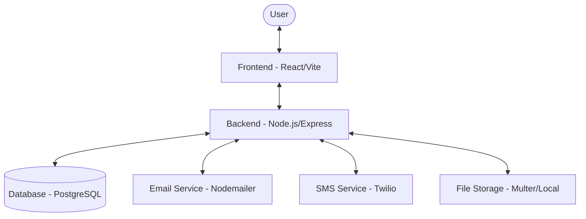
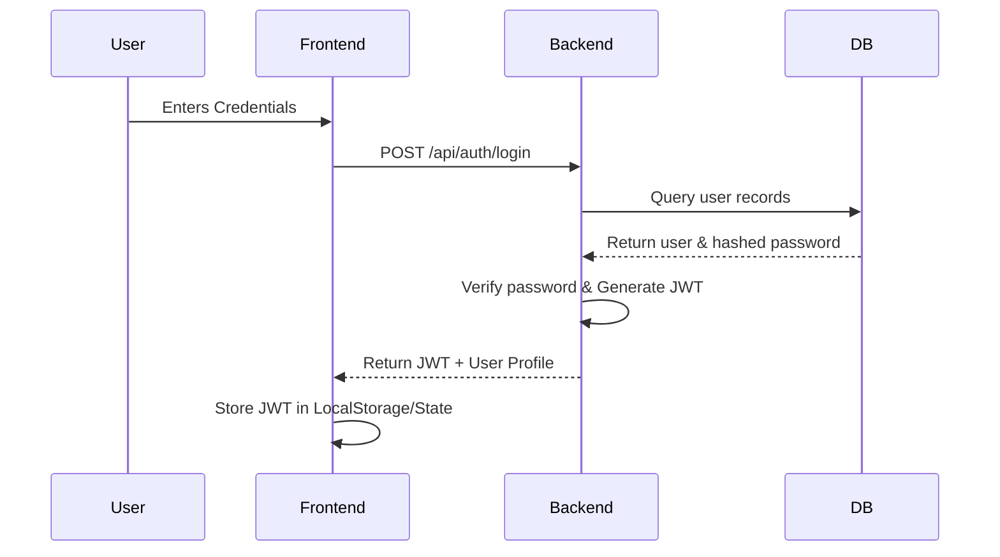

# Project Architecture Overview

The School CRM System follows a modern decoupled architecture with a clear separation between the frontend, backend, and database layers.

## Architecture Diagram



## Architecture Diagram Explained

The diagram illustrates a **multi-tier client-server architecture**:

1.  **Client Layer (Frontend)**: A React application that provides the user interface. It manages state locally and communicates with the backend via RESTful APIs.
2.  **API Layer (Backend)**: A Node.js/Express server that acts as the orchestration layer. It handles authentication, validates requests, and executes business logic.
3.  **Data Layer (Database)**: A PostgreSQL database where all persistent data (students, teachers, grades) is stored. Sequelize ORM manages the mapping between JavaScript objects and SQL tables.
4.  **Integration Layer**: External services like Nodemailer and Twilio are utilized for out-of-band communication (notifications).

## Component Breakdown

### 1. Frontend (`/frontend`)
- **Framework**: React 19 (Vite-based)
- **Styling**: Tailwind CSS for responsive and modern UI.
- **Routing**: React Router DOM (v7) for client-side navigation.
- **Data Fetching**: Axios for API communication.
- **Visualization**: Recharts for academic performance tracking.
- **Icons**: Lucide React.

### 2. Backend (`/backend`)
- **Runtime**: Node.js with Express.js framework.
- **ORM**: Sequelize for database interactions and migrations.
- **Authentication**: JWT-based role-based access control (RBAC) with `bcryptjs`.
- **Validation**: Joi for request payload validation.
- **File Handling**: Multer for handling student/data uploads.
- **Logging**: Winston for system logging.
- **Task Scheduling**: Node-cron for automated notifications.

### 3. Database (`/database`)
- **Engine**: PostgreSQL.
- **Schema**: Defined in `database/schema.sql`.
- **Migrations**: Managed via Sequelize scripts in `backend/scripts/`.

## Key Directory Structure

```text
root/
├── frontend/             # React application
│   ├── src/
│   │   ├── components/  # UI Components
│   │   ├── pages/       # Page views
│   │   ├── services/    # API integration
│   │   └── utils/       # Helpers
├── backend/              # Node.js API
│   ├── controllers/      # Business logic
│   ├── models/           # Database models (Sequelize)
│   ├── routes/           # API endpoints
│   ├── scripts/          # Migrations/Setup
│   └── middleware/       # Auth & Validation
└── database/             # Raw SQL schema
```

## System Workflow

The following section explains the end-to-end flow of common operations in the system.

### 1. User Authentication Flow


### 2. Data Management Workflow (e.g., Adding a Student)
1.  **Request Initiation**: An Admin user fills out a form in the **Frontend**.
2.  **Validation**: The Frontend performs basic validation (required fields, formats).
3.  **API Call**: An `axios` POST request is sent to the **Backend** with the JWT in the header.
4.  **Authorization**: Backend middleware verifies the JWT and checks if the user has `ADMIN` permissions.
5.  **Logic Execution**: The `StudentController` processes the data, potentially generating unique IDs or formatting fields.
6.  **Persistence**: The controller uses the `Student` **Sequelize model** to `create` a new record in **PostgreSQL**.
7.  **Notification (Optional)**: If configured, the backend triggers a background task (using `nodemailer`) to send a welcome email to the parent.
8.  **Response**: The Backend returns a success message, and the Frontend updates the UI list to show the new student.

### 3. Bulk Upload Workflow
1.  **Upload**: User uploads a CSV/Excel file.
2.  **Parsing**: The Backend uses `csv-parse` or `xlsx` to convert the file into a JSON array.
3.  **Transaction**: Sequelize starts a database transaction to ensure data integrity.
4.  **Batch Processing**: Data is validated row-by-row and inserted.
5.  **Completion**: The transaction is committed, and results (success/failure counts) are returned to the user.
