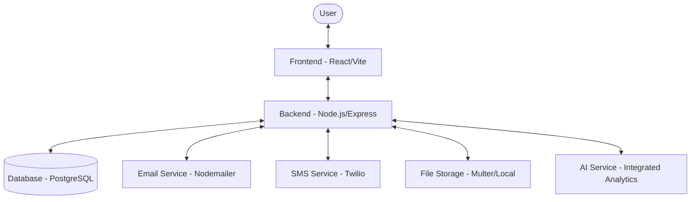
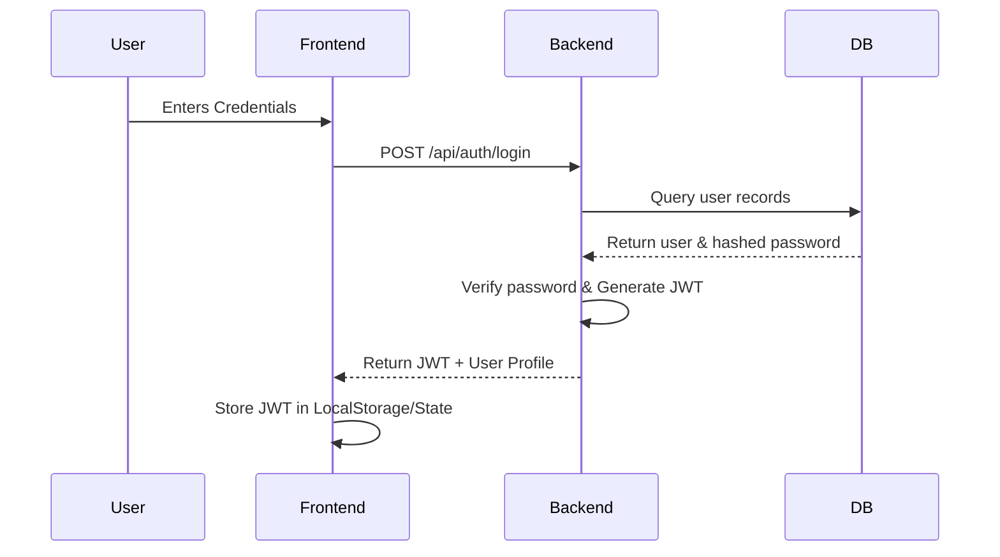

# Project Architecture Overview

The School CRM System follows a modern decoupled architecture with a clear separation between the frontend, backend, and database layers.

## Architecture Diagram



## Architecture Diagram Explained

The diagram illustrates a **multi-tier client-server architecture**:

1.  **Client Layer (Frontend)**: A React application that provides the user interface. It manages state locally and communicates with the backend via RESTful APIs.
2.  **API Layer (Backend)**: A Node.js/Express server that acts as the orchestration layer. It handles authentication, validates requests, and executes business logic.
3.  **Data Layer (Database)**: A PostgreSQL database where all persistent data (students, teachers, grades) is stored. Sequelize ORM manages the mapping between JavaScript objects and SQL tables.
4.  **Integration Layer**: External services like Nodemailer and Twilio are utilized for out-of-band communication (notifications).

## Component Breakdown

### 1. Frontend (`/frontend`)
- **Framework**: React 19.2.0 (Vite 7.2.4-based)
- **Styling**: Tailwind CSS 3.4.19 for responsive and modern UI.
- **Routing**: React Router DOM v7.13.0 for client-side navigation.
- **Data Fetching**: Axios 1.6.2 for API communication.
- **Visualization**: Recharts 3.7.0 for academic performance tracking.
- **Icons**: Lucide React 0.563.0.
- **File Processing**: xlsx 0.18.5 for Excel file handling.
- **Build Tool**: Vite 7.2.4 with React plugin.
- **Linting**: ESLint 9.39.1 with React hooks and refresh plugins.

### 2. Backend (`/backend`)
- **Runtime**: Node.js with Express.js 4.18.2 framework.
- **ORM**: Sequelize 6.37.7 for database interactions and migrations.
- **Authentication**: JWT 9.0.2-based role-based access control (RBAC) with bcryptjs 2.4.3.
- **Validation**: Joi 17.11.0 for request payload validation.
- **File Handling**: Multer 1.4.5-lts.1 for handling student/data uploads.
- **Logging**: Winston 3.11.0 for system logging.
- **Task Scheduling**: Node-cron 3.0.3 for automated notifications.
- **Database**: PostgreSQL with pg 8.18.0 driver.
- **Email**: Nodemailer 6.9.7 for email notifications.
- **SMS/WhatsApp**: Twilio 4.23.0 for messaging services.
- **File Processing**: csv-parse 6.1.0, csv-parser 3.2.0, exceljs 4.4.0, xlsx 0.18.5 for bulk data imports.
- **PDF Generation**: PDFKit 0.14.0 for report generation.
- **Testing**: Jest 29.7.0 with Supertest 6.3.3 for API testing.
- **Development**: Nodemon 3.0.2 for hot reloading.

### 3. Database (`/database`)
- **Engine**: PostgreSQL.
- **Schema**: Defined in `database/schema.sql`.
- **Migrations**: Managed via Sequelize scripts in `backend/scripts/`.
- **Key Tables**: Users, Roles, Students, Classes, Subjects, Marks, Attendance, Fees, Audit Logs, etc.

## Key Directory Structure

```
root/
├── ARCHITECTURE.md          # This architecture documentation
├── ARCHITECTURE.txt         # Alternative architecture notes
├── diag.js                  # Diagram generation script
├── README.md                # Project overview and setup guide
├── backend/                 # Node.js API server
│   ├── package.json         # Backend dependencies and scripts
│   ├── server.js            # Main server entry point
│   ├── backend/             # Additional backend files
│   │   └── uploads/         # File upload directory
│   ├── config/              # Configuration files
│   │   ├── auth.js          # Authentication config
│   │   └── database.js      # Database connection config
│   ├── controllers/         # Business logic controllers
│   │   ├── aiController.js
│   │   ├── analyticsController.js
│   │   ├── auditController.js
│   │   ├── authController.js
│   │   ├── customerController.js
│   │   ├── feeController.js
│   │   ├── gradeCalculator.js
│   │   ├── interactionController.js
│   │   ├── leadController.js
│   │   ├── rankingController.js
│   │   ├── studentController.js
│   │   └── userController.js
│   ├── database/            # Database related files
│   ├── middleware/          # Express middleware
│   │   ├── audit.js
│   │   ├── auth.js
│   │   ├── validation.js
│   │   └── validator.js
│   ├── models/              # Sequelize database models
│   │   ├── AuditLog.js
│   │   ├── Customer.js
│   │   ├── Fee.js
│   │   ├── index.js
│   │   ├── Interaction.js
│   │   ├── Lead.js
│   │   ├── Mark.js
│   │   ├── school.js
│   │   ├── Student.js
│   │   ├── Subject.js
│   │   └── User.js
│   ├── public/
│   │   └── templates/       # Email/SMS templates
│   ├── routes/              # API route definitions
│   │   ├── ai.routes.js
│   │   ├── analytics.js
│   │   ├── attendance.routes.js
│   │   ├── audit.js
│   │   ├── auth.js
│   │   ├── auth.routes.js
│   │   ├── classFeeStructure.routes.js
│   │   ├── customers.js
│   │   ├── fees.js
│   │   ├── grades.routes.js
│   │   ├── interactions.js
│   │   ├── leads.js
│   │   ├── marks.routes.js
│   │   ├── master.routes.js
│   │   ├── quick-action.routes.js
│   │   ├── rankings.js
│   │   ├── reports.routes.js
│   │   ├── student.routes.js
│   │   ├── students.js
│   │   ├── teacher.routes.js
│   │   └── users.js
│   ├── scripts/             # Database scripts and migrations
│   │   ├── add_parent_info_to_students.js
│   │   ├── add_sample_parents.js
│   │   ├── assignSubjectsToAllClasses.js
│   │   ├── check_enum_values.js
│   │   ├── check_existing_parents.js
│   │   ├── check_parents_structure.js
│   │   ├── checkFeeTables.js
│   │   ├── create_fees_table.js
│   │   ├── create_parents_table.js
│   │   ├── create_student_template.js
│   │   ├── createClassFeeStructure.js
│   │   ├── createDatabase.js
│   │   ├── createSampleFees.js
│   │   ├── createUsers.js
│   │   ├── fixAcademicYearFormat.js
│   │   ├── fixEnrollmentYear.js
│   │   ├── fixWhereClause.js
│   │   ├── migrate_add_roll_numbers.js
│   │   ├── migrate.js
│   │   ├── resetExamTypes.js
│   │   ├── resetSubjects.js
│   │   ├── seedAllData.js
│   │   ├── update_attendance_schema.js
│   │   ├── update_parents_table.js
│   │   └── updateAcademicYear2026.js
│   ├── services/            # Business services
│   │   ├── aiService.js
│   │   ├── emailService.js
│   │   ├── fileParserService.js
│   │   ├── notificationService.js
│   │   └── studentService.js
│   ├── uploads/             # Uploaded files directory
│   └── utils/               # Utility functions
├── database/                # Database schema and migrations
│   ├── schema.sql           # PostgreSQL schema definition
│   └── migrations/          # Migration scripts
└── frontend/                # React frontend application
    ├── package.json         # Frontend dependencies
    ├── index.html           # Main HTML file
    ├── vite.config.js       # Vite configuration
    ├── tailwind.config.js   # Tailwind CSS config
    ├── postcss.config.js    # PostCSS config
    ├── eslint.config.js     # ESLint configuration
    ├── public/              # Static assets
    └── src/                 # React source code
        ├── components/      # Reusable UI components
        ├── pages/           # Page components
        ├── services/        # API service functions
        └── utils/           # Frontend utilities
```

## Key Features

- **Comprehensive Administration**: Efficient management of students, teachers, classes, and roles.
- **Academic Tracking**: Robust systems for recording and monitoring marks, attendance, and exam results.
- **Automated Notifications**: Integrated Email, SMS, and WhatsApp alerts for attendance and performance updates.
- **Bulk Data Management**: Support for bulk student and data uploads via CSV/Excel.
- **Secure Authentication**: Role-based access control with JWT-secured endpoints.
- **AI Integration**: AI-powered analytics and insights for student performance.
- **Audit Logging**: Comprehensive audit trails for all system activities.
- **Fee Management**: Automated fee calculation, tracking, and reporting.
- **Lead Management**: CRM features for managing prospective students and parents.
- **Reporting**: Detailed reports on academic performance, attendance, and finances.

## System Workflow

The following section explains the end-to-end flow of common operations in the system.

### 1. User Authentication Flow


### 2. Data Management Workflow (e.g., Adding a Student)
1.  **Request Initiation**: An Admin user fills out a form in the **Frontend**.
2.  **Validation**: The Frontend performs basic validation (required fields, formats).
3.  **API Call**: An `axios` POST request is sent to the **Backend** with the JWT in the header.
4.  **Authorization**: Backend middleware verifies the JWT and checks if the user has `ADMIN` permissions.
5.  **Logic Execution**: The `StudentController` processes the data, potentially generating unique IDs or formatting fields.
6.  **Persistence**: The controller uses the `Student` **Sequelize model** to `create` a new record in **PostgreSQL**.
7.  **Notification (Optional)**: If configured, the backend triggers a background task (using `nodemailer`) to send a welcome email to the parent.
8.  **Response**: The Backend returns a success message, and the Frontend updates the UI list to show the new student.

### 3. Bulk Upload Workflow
1.  **Upload**: User uploads a CSV/Excel file.
2.  **Parsing**: The Backend uses `csv-parse` or `xlsx` to convert the file into a JSON array.
3.  **Transaction**: Sequelize starts a database transaction to ensure data integrity.
4.  **Batch Processing**: Data is validated row-by-row and inserted.
5.  **Completion**: The transaction is committed, and results (success/failure counts) are returned to the user.

## API Endpoints Overview

The backend provides RESTful APIs organized by functionality:

- **Authentication** (`/api/auth`): Login, logout, token refresh
- **Users** (`/api/users`): User management for admins
- **Students** (`/api/students`): Student CRUD operations
- **Attendance** (`/api/attendance`): Attendance tracking and reporting
- **Marks** (`/api/marks`): Grade management and calculations
- **Fees** (`/api/fees`): Fee structure and payment tracking
- **Analytics** (`/api/analytics`): Performance analytics and insights
- **AI** (`/api/ai`): AI-powered recommendations and analysis
- **Audit** (`/api/audit`): System activity logging
- **Reports** (`/api/reports`): Various report generation
- **Leads** (`/api/leads`): CRM lead management
- **Interactions** (`/api/interactions`): Communication tracking

All endpoints are protected with JWT authentication and role-based permissions.

## Database Schema Overview

The PostgreSQL database consists of the following key entities:

- **Users & Roles**: User authentication and authorization system
- **Students**: Student profiles with parent information
- **Classes & Subjects**: Academic structure management
- **Marks & Attendance**: Academic performance tracking
- **Fees**: Financial management and fee structures
- **Audit Logs**: System activity tracking
- **Leads & Customers**: CRM functionality
- **Interactions**: Communication history
- **Notifications**: Automated messaging system

The schema includes proper relationships, indexes, and triggers for data integrity and performance.
