# System Diagrams for School CRM System

This document contains various architectural and design diagrams for the School CRM System using Mermaid syntax.

## 1. System Architecture Diagram

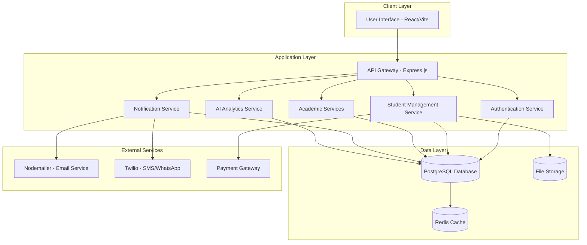

## 2. Use Case Diagram

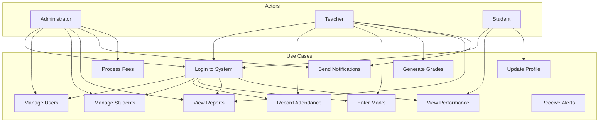

## 3. ER Diagram (Database)

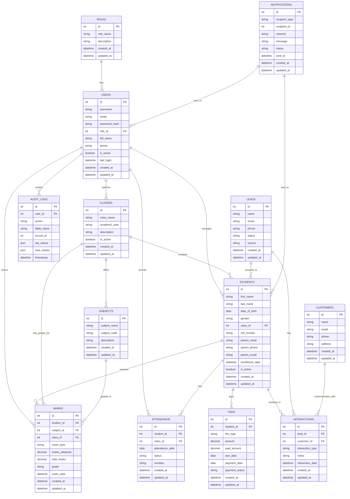

## 4. DFD Diagram (Data Flow Diagram)

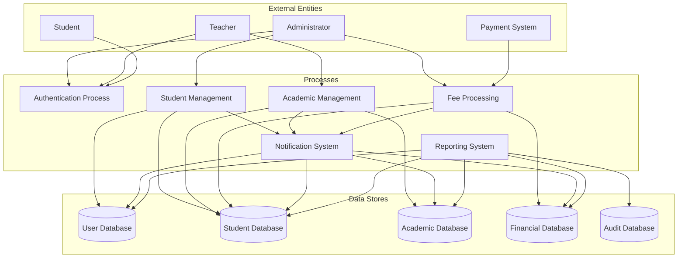

## 5. Class Diagram

```mermaid
classDiagram
    class User {
        +int id
        +string username
        +string email
        +string password_hash
        +Role role
        +string full_name
        +string phone
        +boolean is_active
        +DateTime last_login
        +DateTime created_at
        +DateTime updated_at
        +login()
        +logout()
        +updateProfile()
    }
    
    class Role {
        +int id
        +string role_name
        +string description
        +DateTime created_at
        +DateTime updated_at
    }
    
    class Student {
        +int id
        +string first_name
        +string last_name
        +Date date_of_birth
        +string gender
        +Class class
        +string roll_number
        +string parent_name
        +string parent_phone
        +string parent_email
        +DateTime enrollment_date
        +boolean is_active
        +DateTime created_at
        +DateTime updated_at
        +getMarks()
        +getAttendance()
        +updateProfile()
    }
    
    class Class {
        +int id
        +string class_name
        +string academic_year
        +string description
        +boolean is_active
        +DateTime created_at
        +DateTime updated_at
        +getStudents()
        +getSubjects()
    }
    
    class Subject {
        +int id
        +string subject_name
        +string subject_code
        +string description
        +DateTime created_at
        +DateTime updated_at
    }
    
    class Mark {
        +int id
        +Student student
        +Subject subject
        +Class class
        +string exam_type
        +decimal marks_obtained
        +decimal total_marks
        +string grade
        +DateTime exam_date
        +DateTime created_at
        +DateTime updated_at
        +calculateGrade()
    }
    
    class Attendance {
        +int id
        +Student student
        +Class class
        +Date attendance_date
        +string status
        +string remarks
        +DateTime created_at
        +DateTime updated_at
    }
    
    class Fee {
        +int id
        +Student student
        +string fee_type
        +decimal amount
        +decimal paid_amount
        +Date due_date
        +Date payment_date
        +string payment_status
        +DateTime created_at
        +DateTime updated_at
        +calculateBalance()
    }
    
    class AuditLog {
        +int id
        +User user
        +string action
        +string table_name
        +int record_id
        +JSON old_values
        +JSON new_values
        +DateTime timestamp
    }
    
    class NotificationService {
        +sendEmail()
        +sendSMS()
        +sendWhatsApp()
        +scheduleNotification()
    }
    
    class AIService {
        +analyzePerformance()
        +predictGrades()
        +generateInsights()
    }
    
    User ||--o{ Student : manages
    User ||--o{ Class : teaches
    User ||--o{ Mark : enters
    User ||--o{ Attendance : records
    User ||--o{ AuditLog : creates
    
    Role ||--o{ User : has
    
    Class ||--o{ Student : contains
    Class ||--o{ Subject : offers
    Class ||--o{ Mark : has_grades_for
    Class ||--o{ Attendance : has_attendance_for
    
    Student ||--o{ Mark : receives
    Student ||--o{ Attendance : has
    Student ||--o{ Fee : pays
    
    Subject ||--o{ Mark : graded_in
```

## 6. Sequence Diagram - Student Registration

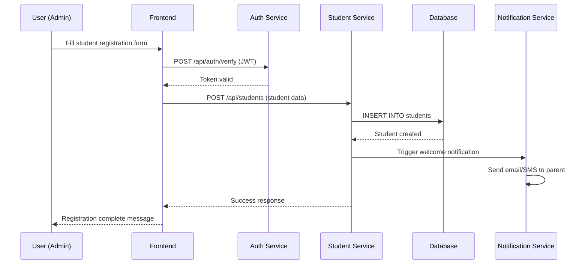

## 7. Sequence Diagram - Grade Entry

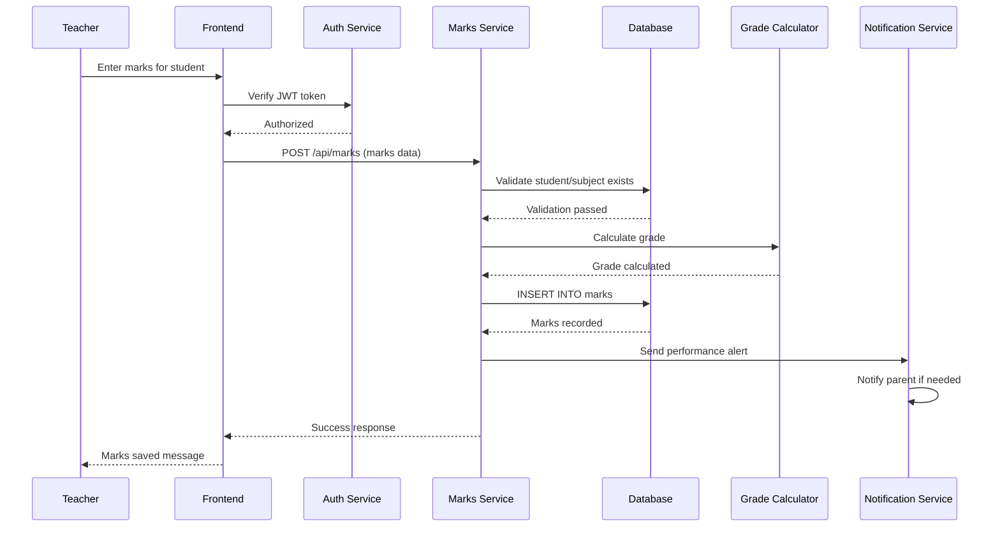

## 8. State Chart Diagram - Student Enrollment Status

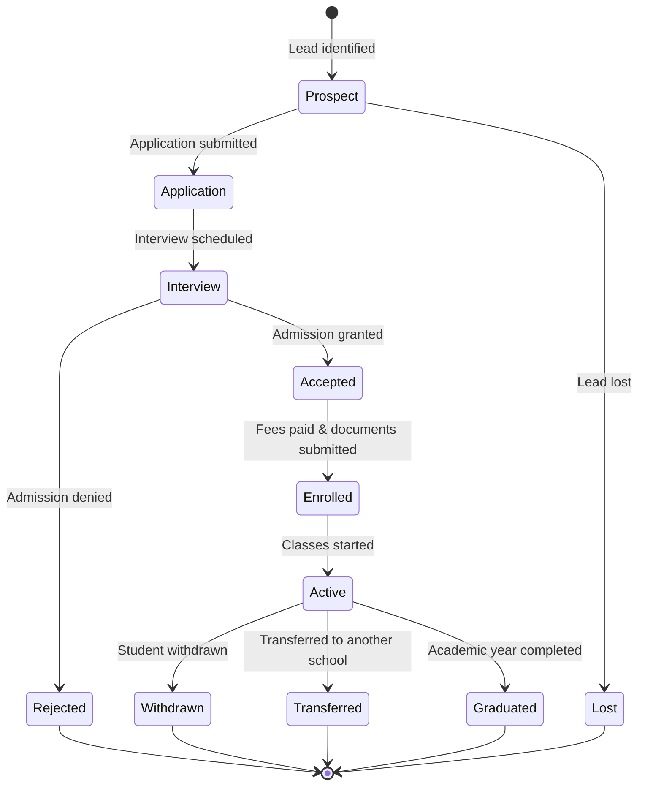

## 9. Activity Diagram - Student Admission Process

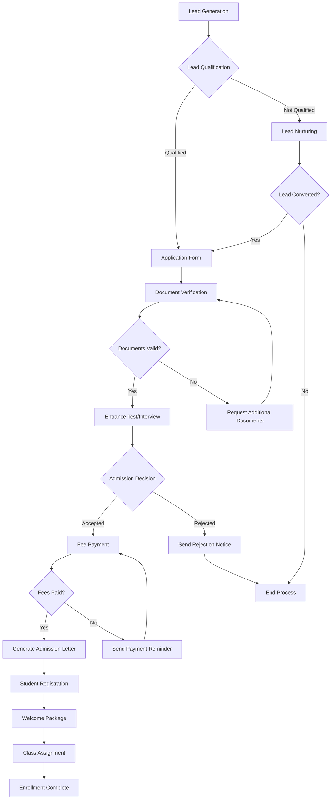

## 10. Deployment Diagram

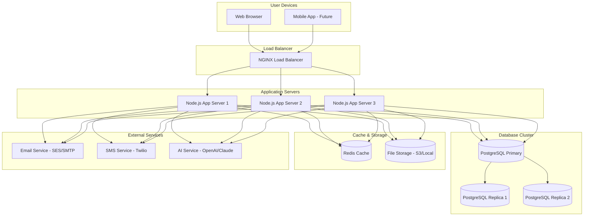

## 11. Interaction Diagram - Login Process

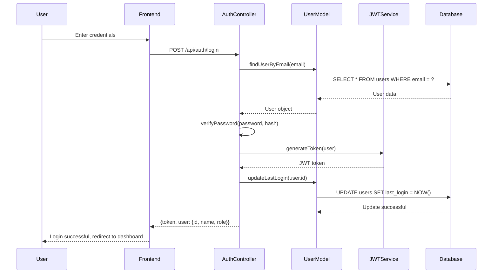

## 12. State Chart Diagram - Fee Payment Status

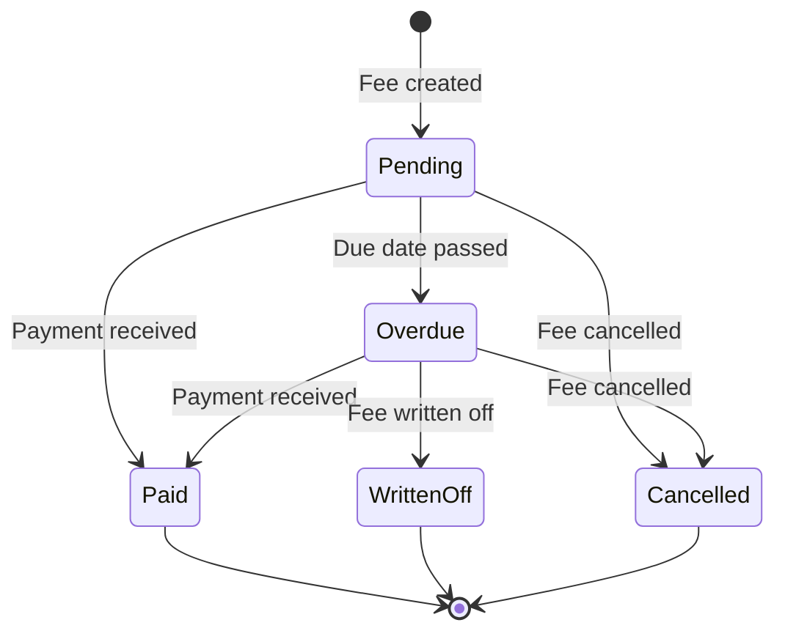

## 13. Activity Diagram - Report Generation

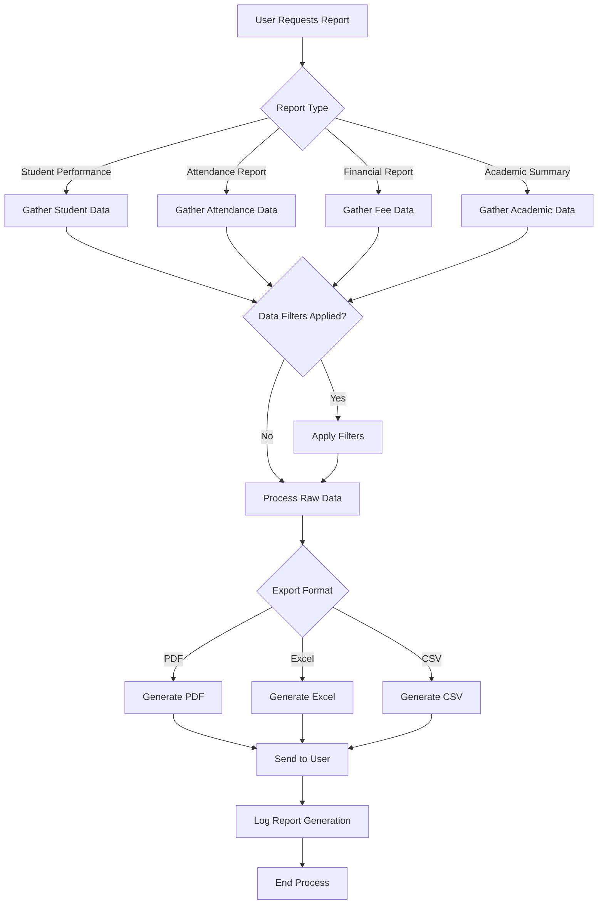